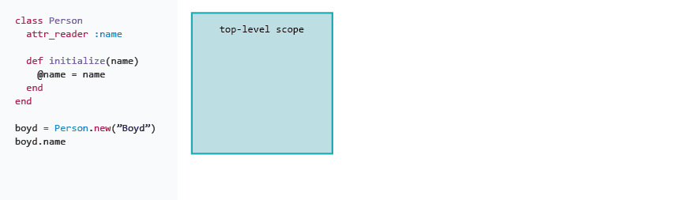

# Ruby Drill: Exploring Scope 
 
## Summary
When we write our applications, we create objects: strings, arrays, hashes, custom objects, etc.  After creating an object, we often we want to ues it later in our program.  So, we define a variable and assign our object to the variable.

We have different options when defining variables: global variables, constants, local variables, instance variables, and class variables.  Our choice of variable type will affect when and how we're able to access a variable.

The question we'll explore in this challenge is "Where are our variables visible?".  In more technical language, we might ask, "What is the *scope* of a variable?".  We'll explore and refine our understanding of scope in Ruby.


### Changing Scope


*Figure 1*. Visual model of changing scope as code executes.

Our programs begin executing in a top-level scope.  Some code triggers a change in scope.  For example, using the keyword `class` when defining a class changes scope, and the code defining the class is executed within this new scope.  Then, when the class definition is complete, our program returns to the previous scope.  Or, when we call a method, the method is executed in a new scope.  When the method is finished executing, our program again returns to the previous scope and continues.  This process is modeled in Figure 1.

When scope changes, we lose access to some variables, as we'll see.


*Note:*   The section [*Scope of Constants and Variables*][pickaxe guide scope] from *Programming Ruby: The Pragmatic Programmer's Guide* can serve as an additional reference on the scope of .

##Releases

###Release 0 : Objectify it.

Choose an object to create (bicycle, aquarium) and use it to explore the following.  **Note:** We will use this object in lots of examples this week - pick something fun. 

#### Local variables and methods

Write a program that has one local variable `local_var` defined in the global scope and one method `get_local_var` defined in the global scope.  
The method should return the value of the local variable.  Does it work?  What happens if you define a local variable of the same name within the body of the method definition and assign it a different value?

#### Classes and instance variables

Add a class `BasicClass` to your program.  Duplicate your `get_local_var` method within the class.

Create a new instance of `BasicClass` and call the `get_local_var` method on it.  What happens?

Now add an instance variable `@instance_var` to your class and define an instance method `get_instance_var` for your class that returns the value of `@instance_var`.

Try creating a new instance of the class and calling `get_instance_var` on it.  What happens?

#### Getters and setters

Your instance method `get_instance_var` is an example of a *getter method*.   It allows us *read access* to an instance variable of an object.

A *setter method* is similar, except that instead of reading an instance variable, it allows us to *write* a new value to the instance variable.

Create a setter method for `BasicClass` named `set_instance_var=` that takes one argument and then assigns the value of the argument to the instance variable `@instance_var`.

Note that a commonly used pattern for setter methods is to name them with a `=` at the end.  This is simply syntactic sugar that allows us to write code like this:

```ruby
foo = BasicClass.new
foo.get_instance_var
# => 'default value'
foo.set_instance_var = 'some other value'
```

The last line is the same as writing `foo.set_instance_var=('some other value')`, it's just easier to read.  Thank you, Ruby.

#### Class methods

A *class method* is a method on a class, as opposed to a method on an instance of a class.  It works like this:

```ruby
class MyCoolClass
  def self.some_method
    "quack"
  end
end

MyCoolClass.some_method # => "quack"
```

What are some class methods you've seen?  `MyCoolClass.new` is one class method that every class in Ruby comes with, which returns a new instance of a class.

#### Class variables

An *instance variable*, as the name implies, is associated with an *instance* of a class.  In other words, its value can be different for different objects created by the same class.

Try creating two different objects from `BasicClass` and then using your setter method to give each of them a different value for the `@instance_var`.  Then use your getter method on each to see if they are *actually* different.

A *class variable*, on the other hand, is the same for all instances of a class.

Within your class definition, create the class variable `@@class_var` and assign it a value.

Then define a getter and setter method for `@@class_var` and play around with assigning new values to it from multiple instances of the class.  

What happens if you change the value of `@@class_var` from one instance, and then create a new instance of the class and use your getter method to read the value of `@@class_var`?

#### Global variables and constants

Within your global scope, create a constant `THIS_IS_A_CONSTANT` and a global variable `$global_var`.  

Then write getter and setter methods for your constant and global variable and duplicate them within your class and in the global scope.  (I know, this is not DRY, but we're just experimenting here).

What happens when you try to read from and write to constants and global variables from different place in your program?  Did you get any errors?  Did you Google the errors? ;) 


<!-- ##Optimize Your Learning  -->

##Resources

[pickaxe guide scope]: http://ruby-doc.com/docs/ProgrammingRuby/html/language.html#UP
